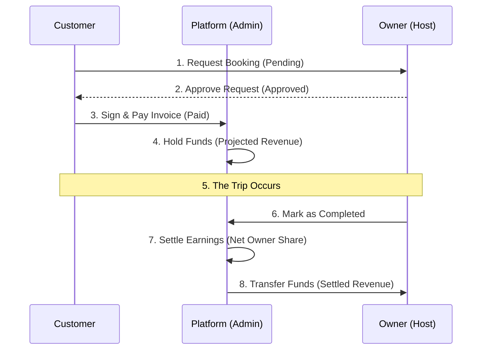

# Neon Monolith: Global Project Workflow & System Architecture

This document provides a high-fidelity overview of how the **Car Rental System (Neon Monolith)** operates. It covers the lifecycles of users, assets, and financial transactions.

---

## 1. System Ecosystem (Roles)

| Role | Responsibility | Authority |
| :--- | :--- | :--- |
| **Customer** | Renting vehicles, paying invoices, reviewing hosts. | Can book assets and manage their personal itinerary. |
| **Owner (Host)** | Listing vehicles, managing bookings, filing damage reports. | Controls their fleet and chooses which renters to accept. |
| **Admin** | Oversight, auditing, system configuration, dispute resolution. | Sovereign authority over all platform identities and assets. |

---

## 2. Core Operational Workflows

### A. Identity Lifecycle (Verification)
1. **Registration**: User joins the platform as a Renter or Host.
2. **Verification Request**: User uploads documents (e.g., NID, License) via the **ID Hub**.
3. **Admin Audit**: Admin reviews the credentials in the **Identity Governance** queue.
4. **Authorization**: Once approved, the user gains "Verified" status, unlocking higher booking limits or the ability to list cars.

### B. Fleet Lifecycle (Car Listings)
1. **Creation**: Owner lists a vehicle with detailed specs and high-resolution images.
2. **Pending Clearance**: The car is marked as `pending` and is **not visible** to the public.
3. **Admin Inspection**: Admin reviews the asset in the **Fleet Oversight** hub.
4. **Activation**: Admin clicks **Authorize**. The car is now live and bookable on the marketplace.

---

## 3. The Transactional & Financial Cycle

This is the most critical part of the platform. It involves the movement of money and the transition of booking states.

### Workflow Diagram (Mermaid)

### Financial Settlement Logic
The platform operates on a **Commission-Based Model**.

1. **Total Volume**: The total price paid by the Customer.
2. **Platform Commission**: A percentage (default **10%**) defined in the **Sovereign Registry**.
3. **Platform Cut**: Calculated as `Total Volume * Commission% / 100`.
4. **Host Settlement**: The remaining **90%** is recorded in the `earnings` table for the Host.

**Example Transaction:**
- **Booking Total**: ৳10,000
- **Platform Fee (10%)**: ৳1,000 (Goes to Admin Analytics)
- **Host Earning**: ৳9,000 (Goes to Host Ledger)

---

## 4. Admin Command Hub Sections

The Admin Panel is divided into strategic hubs for high-density management:

- **Command Center (Dashboard)**: Real-time velocity monitoring and critical action queues.
- **Fleet Hub**: Authorization and management of vehicle listings.
- **ID Hub**: Background verification and participant governance.
- **Financials**: Deep-dive auditing of platform volume and revenue splits.
- **Support**: Interception of stakeholder communications for compliance monitoring.
- **Registry**: Global configuration of commission rates and system parameters.

---

## 5. Summary of System States

| Entity | Statuses | Definition |
| :--- | :--- | :--- |
| **Booking** | `pending`, `approved`, `completed`, `cancelled` | Progresses forward based on participant actions. |
| **Car** | `pending`, `approved`, `rejected` | Visibility controlled by Admin audit. |
| **Payment** | `pending`, `paid` | Locked until Customer settles the invoice. |

> [!TIP]
> **Key Rule**: A booking cannot be marked as `completed` unless the payment status is `paid`. This protects Hosts from completing trips without receiving compensation.
